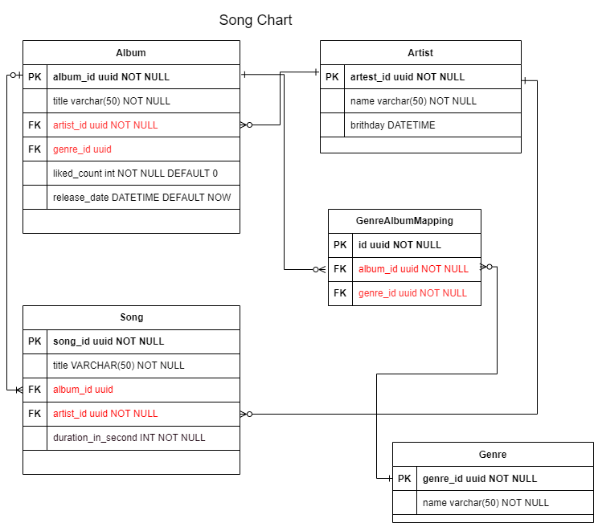

# Database-System-Course
112-1
### Class Slides
- [Intro](https://docs.google.com/presentation/d/1CP0D92DA8Ae8oyIKSquqUuTUpVqwLGT-14T32l9pf5U/edit#slide=id.g241186a303b_0_39)
- [CRUD in SQL DB](https://docs.google.com/presentation/d/1amn8pDX2Wx4N6ZjzhCGoQFJH4DqaRcQ2DJAdg3hbIrA/edit?usp=sharing)

### HW
- [HW0 video](https://youtu.be/0YByBBE8Av4)
- [HW1 video](https://youtu.be/NGauKnFqink)  
  
- [HW2 video](https://youtu.be/kWTY3Whv5Y0)  
- [HW3 video](https://youtu.be/8huvl1bzgZs)
- HW4 attempts for final
    - [ISS Tracker repo](https://github.com/patty111/ISS-Tracker)
    - [Data 3D Visualize using globe.gl]()
  
 
